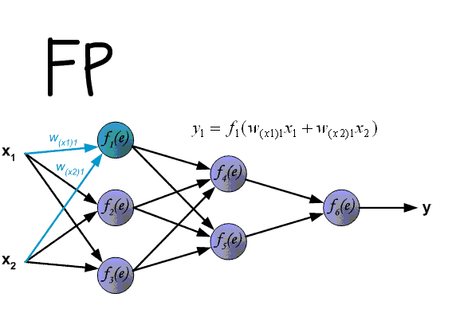

# 语言
## 语言
### 语言
- PXT
- X86
- MIPS  
1. C++
1. Python
1. Java


checkbox:  
明天要做的事：  
- [ ] 上班  
- [X] 下班  
- [X] 回家

超链接  
[百度](www.baidu.com "一个搜索引擎")  




字体:  
*斜体*  
**粗体**  
***斜粗体***  
~~删除线~~  

引用：
> 下面这段话是别人说的，我只是转述一下，概不负责。  
> > 嵌套引用
> > 另起一段  
> baidu

代码引用
```c
int main() {
	int a;
	int b;
	int c;
	c = a + b;
	return 0;
}
```  

```java
class Main {
	void print() {
		printLine("Hello, world."};
}
```  

