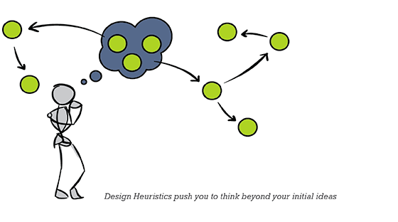

C#  
Java  
C++  

# 语言
## 低级语言
### 二进制代码
- PXT
- X86
- MIPS  

<u>[hello](http://www.hello.com "workd")</u>


明天要做的事：  
- [ ] 上班  
- [X] 下班  
- [X] 回家

[百度](www.baidu.com "一个搜索引擎")  
  
字体:  
*斜体*  
**粗体**  
***斜粗体***  
~~删除线~~
> 应用：下面这段话是别人说的，我只是转述一下，概不负责。  


```c
int main() {
	int a;
	int b;
	int c;
	c = a + b;
	return 0;
}
```  




